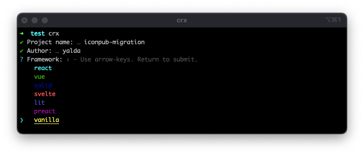
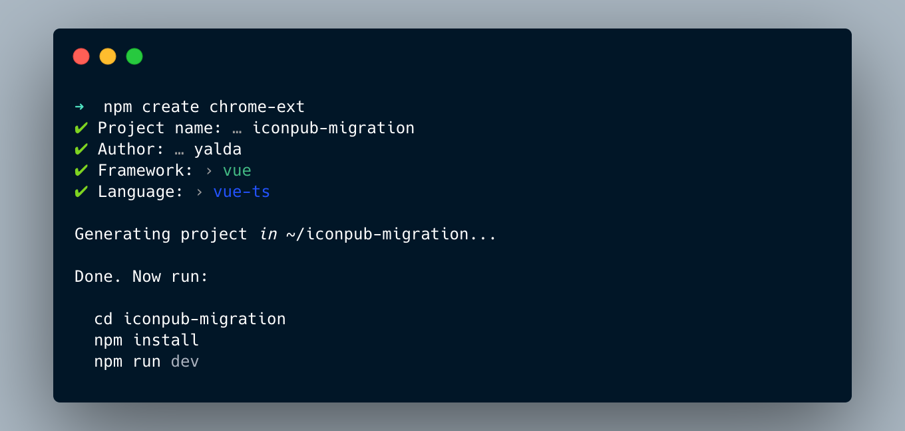
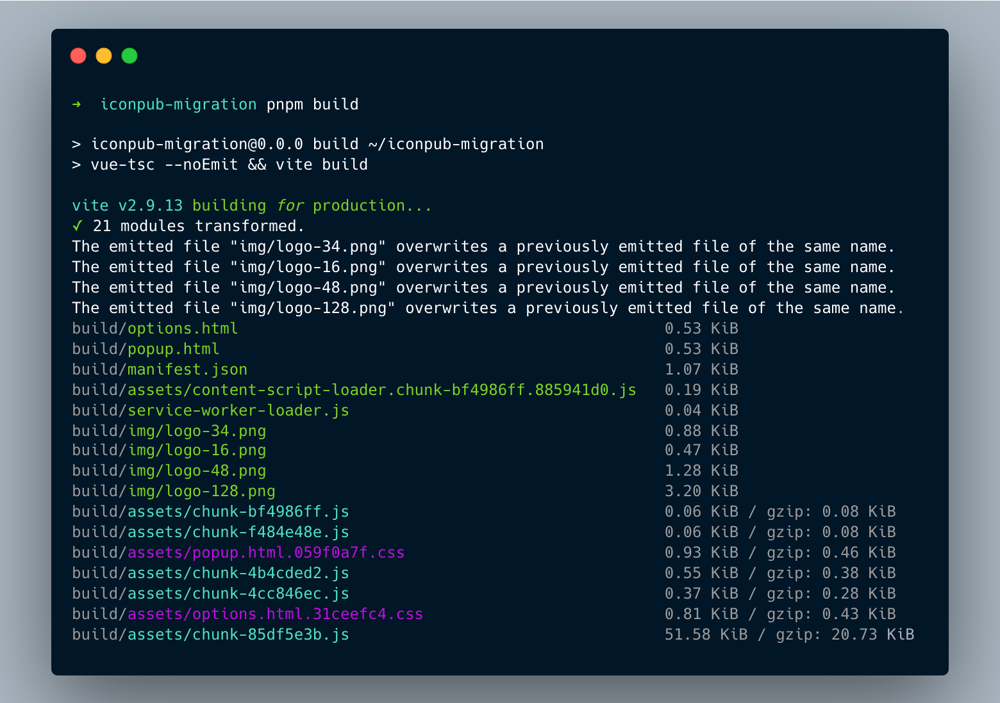

# Create Chrome Extension (.crx)


[](https://www.oscs1024.com/project/guocaoyi/create-chrome-ext?ref=badge_small)
[](https://www.npmjs.com/package/create-chrome-ext)
[](https://www.npmjs.com/package/create-chrome-ext)

[](https://github.com/guocaoyi/create-chrome-ext/actions/workflows/npm-publish.yml)

> Scaffolding your chrome extension, multiple boilerplates supported!

- 🚀 Lightning Fast HMR(use [Vite2](https://vitejs.dev))
- 🥡 Out of Box
- 🌈 Multiple Frontend Framework Supported (9+)
- 🥢 Multiple Language Supported (TypeScript & JavaScript)
- 🧶 Optimized Builds
- 🌗 Light & Dark Mode

[EN](./README.md) · [中文](./README_zh.md)

## Installing

> Node >= 14.18.0

```bash
# use npm-create command, or use pnpm | yarn
λ npm create chrome-ext

# or use npx command
λ npx create-chrome-ext

# or use npm-init command
λ npm init chrome-ext
```

## Usage

You can also directly specify the project name and the template you want to use via additional command line options. For example, to scaffold a Vite + Svelte project, run:

```bash
# npm 6.x
λ npm create chrome-ext@latest my-crx-app --template svelte-js

# or npm 7+, extra double-dash is needed:
λ npm create chrome-ext@latest my-crx-app -- --template react-ts

# or yarn
λ yarn create chrome-ext my-crx-app --template vue-ts

# or pnpm
λ pnpm create chrome-ext my-crx-app --template vanilla-ts
```

You can also generator the project with `crx` cli, run:

```bash
λ npm install create-chrome-ext --global

# and then
λ crx my-crx-app
# or
λ crx my-crx-app --template preact-js
# or use create-chrome-exe (global env)
λ create-chrome-ext my-crx-app
```

## Supported Templates

framework presets include:

[React](https://reactjs.org) · [Vue](https://vuejs.org) · [Svelte](https://svelte.dev) · [Preact](https://preactjs.com) · [Solid](https://www.solidjs.com) · [Alpine](https://alpinejs.dev) · [Lit](https://lit.dev) · [Inferno](https://www.infernojs.org) · [Stencil](https://stenciljs.com) · [Vanilla](http://vanilla-js.com)

languages supported:

[JavaScript](https://www.javascript.com/) · [TypeScript](https://www.typescriptlang.org/)

## Preview




