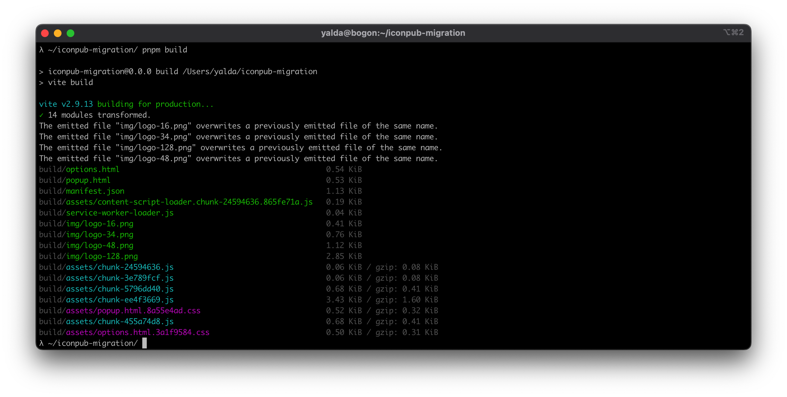
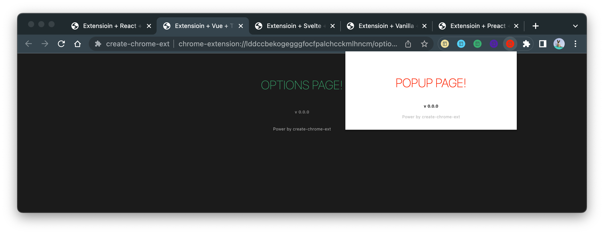

# Create Chrome Ext

[](https://www.npmjs.com/package/create-chrome-ext)
[](https://www.npmjs.com/package/create-chrome-ext)

[](https://github.com/guocaoyi/create-chrome-ext/actions/workflows/npm-publish.yml)


> Next generation chrome extension generater

- ⚡️ Lightning Fast HMR(use vite2)
- 📦 Optimized Builds
- 🗂 Multiple Framework Support
- 📚 Documentation

## Installing

> Node >= 14.18.0

```bash
# with npm
λ npm create chrome-ext@latest

# or with pnpm
λ pnpm create chrome-ext

# or with yarn
λ yarn create chrome-ext

# or with npx
λ npx create-chrome-ext
```

## Usage

You can also directly specify the project name and the template you want to use via additional command line options. For example, to scaffold a Vite + Svelte project, run:

```bash
# npm 6.x
λ npm create chrome-ext@latest my-crx-app --template svelte-js

# or npm 7+, extra double-dash is needed:
λ npm create chrome-ext@latest my-crx-app -- --template react-ts

# or yarn
λ yarn create chrome-ext my-crx-app --template vue-ts

# or pnpm
λ pnpm create chrome-ext my-crx-app --template vanilla-ts
```

You can also generator the project with `crx` cli.
run:

```bash
λ npm install create-chrome-ext --global

# and then
λ crx my-crx-app --template preact-js
```

## Supported Templates

template presets include:

- `lit-js`
- `lit-ts`
- `preact-js`
- `preact-ts`
- `react-js`
- `react-ts`
- `svelte-js`
- `svelte-ts`
- `vanilla-js`
- `vanilla-ts`
- `vue-js`
- `vue-ts`

You can use `.` for the project name to scaffold in the current directory.

## Preview




