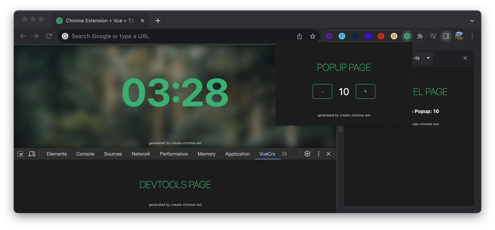
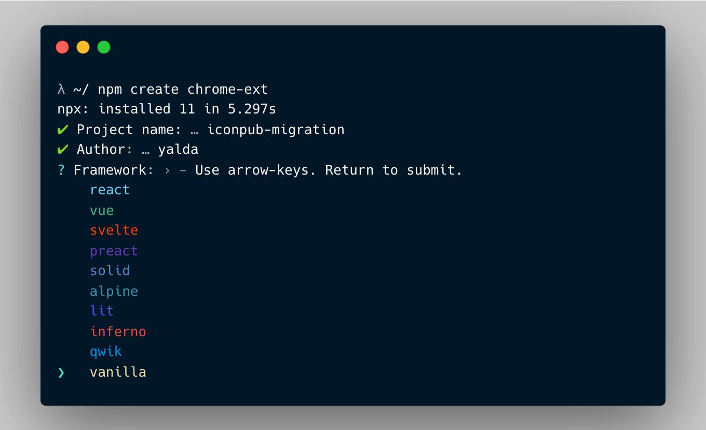
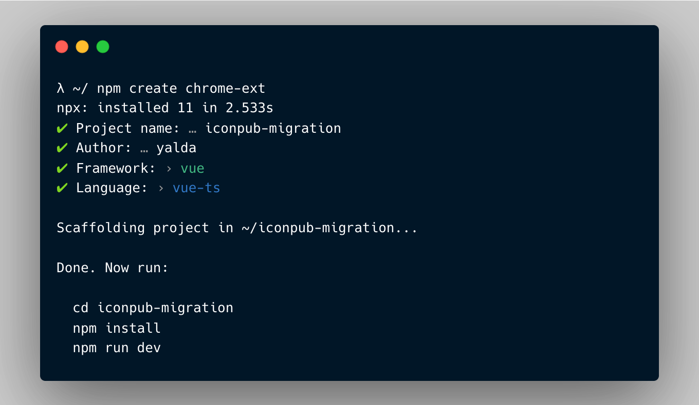
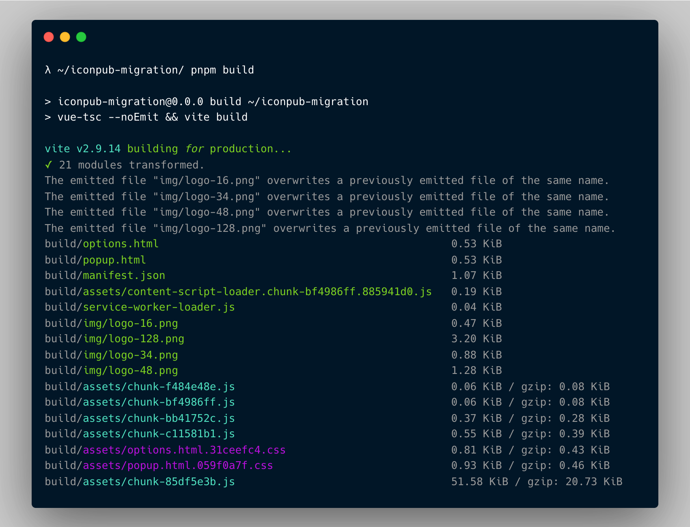

# Créer une extension Chrome (.crx)


[](https://www.oscs1024.com/project/guocaoyi/create-chrome-ext?ref=badge_small)
[](https://www.npmjs.com/package/create-chrome-ext)
[](https://www.npmjs.com/package/create-chrome-ext)

[](https://github.com/guocaoyi/create-chrome-ext/actions/workflows/npm-publish.yml)

> Créez la structure de votre extension Chrome, avec prise en charge de plusieurs modèles de démarrage !

- 🚀 Mise à jour rapide avec HMR (utilisation de [Vite4](https://vitejs.dev))
- 🥡 Prêt à l'emploi
- 🌈 Prise en charge de plusieurs frameworks ([React](https://reactjs.org) · [Vue](https://vuejs.org) · [Svelte](https://svelte.dev) · [Preact](https://preactjs.com) · [Solid](https://www.solidjs.com) · [Alpine](https://alpinejs.dev) · [Lit](https://lit.dev) · [Inferno](https://www.infernojs.org) · [Stencil](https://stenciljs.com) · [Vanilla](http://vanilla-js.com))
- 🥢 Prise en charge de plusieurs langages ([JavaScript](https://www.javascript.com/) · [TypeScript](https://www.typescriptlang.org/))
- 🧶 Création optimisée

[English](../README.md) · [简体中文](./README.zh-CN.md) · [French](./README.fr-FR.md) · [한국어](./README.ko-KR.md) · [Indonesian](./README.id-ID.md) · [Русский](./README.ru-RU.md) · [Deutsch](./README.de-DE.md) · [日本語](./README.ja-JP.md) (Translated by ChatGPT)

## Installation

> Node >= 14.18.0

```bash
# Utilisez la commande npm-create, ou utilisez pnpm | yarn
λ npm create chrome-ext

# ou utilisez la commande npx
λ npx create-chrome-ext

# ou utilisez la commande npm-init
λ npm init chrome-ext
```

## Utilisation

Vous pouvez également spécifier directement le nom du projet et le modèle que vous souhaitez utiliser via des options de ligne de commande supplémentaires. Par exemple, pour créer la structure d'un projet Vite + Svelte, exécutez la commande suivante :

```bash
# npm 6.x
λ npm create chrome-ext@latest my-crx-app --template svelte-js

# ou npm 7+, un double tiret supplémentaire est nécessaire :
λ npm create chrome-ext@latest my-crx-app -- --template react-ts

# ou yarn
λ yarn create chrome-ext my-crx-app --template vue-ts

# ou pnpm
λ pnpm create chrome-ext my-crx-app --template vanilla-ts
```

Vous pouvez également générer le projet avec l'interface de ligne de commande `crx`, exécutez la commande suivante :

```bash
λ npm install create-chrome-ext --global

# puis
λ crx my-crx-app
# ou
λ crx my-crx-app --template preact-js
# ou utilisez create-chrome-exe (environnement global)
λ create-chrome-ext my-crx-app
```

## Aperçu




